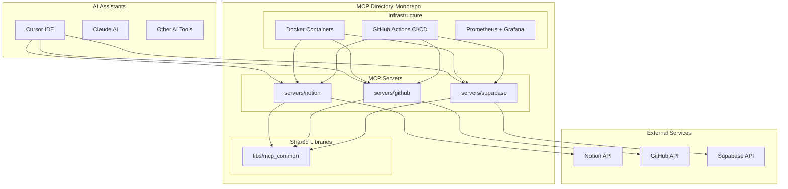
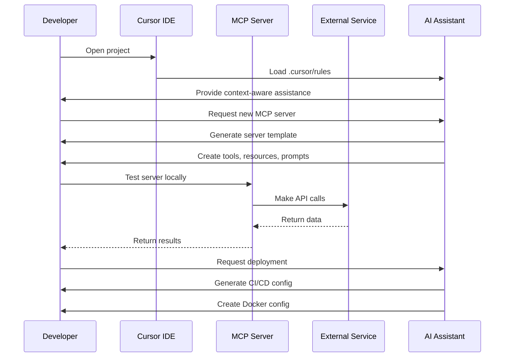

# AI Assistant Documentation

This directory contains comprehensive documentation and resources for AI assistants working with the MCP Directory monorepo.

## Overview

The MCP Directory is a monorepo containing multiple Model Context Protocol (MCP) servers built with FastMCP. Each server provides tools, resources, and prompts for interacting with external services like Notion, GitHub, and Supabase.

## Architecture

### System Architecture



### Development Workflow



## Development Guidelines

### Adding a New MCP Server

1. **Use the template**: Copy `servers/template/` to `servers/my-new-server/`
2. **Update configuration**: Modify `pyproject.toml` with your server details
3. **Implement tools**: Add `@mcp.tool` decorated functions
4. **Add resources**: Implement `@mcp.resource` functions for data access
5. **Create prompts**: Add `@mcp.prompt` functions for AI assistance
6. **Write tests**: Add unit and integration tests
7. **Update documentation**: Add server-specific README

### Tool Development Pattern

```python
from fastmcp import FastMCP, Context
from mcp_common import get_logger, MCPError, ValidationError

mcp = FastMCP("My Server")
logger = get_logger(__name__)

@mcp.tool
async def my_tool(
    param1: str,
    param2: int = 10,
    ctx: Context | None = None,
) -> dict:
    """Tool description.
    
    Args:
        param1: Description of param1
        param2: Description of param2 (default: 10)
        ctx: MCP context for logging
        
    Returns:
        Dictionary containing tool result
    """
    try:
        if ctx:
            await ctx.info(f"Executing tool with param1: {param1}")
        
        # Validate inputs
        if not param1.strip():
            raise ValidationError("param1 cannot be empty")
        
        # Tool logic here
        result = perform_operation(param1, param2)
        
        if ctx:
            await ctx.info("Tool execution completed successfully")
        
        return {
            "success": True,
            "data": result,
            "message": "Operation completed successfully",
        }
        
    except ValidationError as e:
        raise e
    except Exception as e:
        logger.error(f"Tool execution failed: {e}")
        raise MCPError(f"Tool execution failed: {str(e)}")
```

### Resource Development Pattern

```python
@mcp.resource
async def my_resource(uri: str, ctx: Context | None = None) -> str:
    """Resource description.
    
    Args:
        uri: Resource URI (e.g., 'myservice://type/id')
        ctx: MCP context for logging
        
    Returns:
        Resource content as string
    """
    try:
        if ctx:
            await ctx.info(f"Accessing resource: {uri}")
        
        # Parse URI
        if not uri.startswith("myservice://"):
            raise ValidationError("Invalid URI format")
        
        parts = uri.split("/")
        resource_type = parts[2]
        resource_id = parts[3] if len(parts) > 3 else ""
        
        if not resource_id:
            raise ValidationError("Resource ID is required")
        
        # Fetch resource data
        data = fetch_resource_data(resource_type, resource_id)
        
        if ctx:
            await ctx.info(f"Resource accessed successfully: {resource_type}/{resource_id}")
        
        return format_resource_content(data)
        
    except Exception as e:
        logger.error(f"Resource access failed: {e}")
        raise MCPError(f"Failed to access resource: {str(e)}")
```

## Available Servers

### Notion MCP Server

**Purpose**: Notion API integration for document and database management

**Tools**:
- `search_pages(query, page_size=20, page=1)`: Search for pages
- `create_page(parent_id, title, content=None, properties=None)`: Create new page
- `get_page(page_id)`: Retrieve specific page
- `update_page(page_id, properties=None, content=None)`: Update page
- `get_database(database_id)`: Retrieve database

**Resources**:
- `notion://page/<page_id>`: Access page content
- `notion://database/<database_id>`: Access database content

**Configuration**:
```bash
NOTION_API_KEY=your-notion-api-key
```

### GitHub MCP Server

**Purpose**: GitHub API integration for repository management

**Tools**:
- `get_repo(owner, repo)`: Get repository information
- `create_issue(owner, repo, title, body=None)`: Create issue
- `list_pull_requests(owner, repo, state='open')`: List pull requests
- `search_code(query, owner=None, repo=None)`: Search code

**Resources**:
- `github://repo/<owner>/<repo>`: Repository information
- `github://issue/<owner>/<repo>/<number>`: Issue details

**Configuration**:
```bash
GITHUB_TOKEN=your-github-token
```

### Supabase MCP Server

**Purpose**: Supabase integration for database and authentication

**Tools**:
- `query_database(table, filters=None, limit=100)`: Query database
- `create_user(email, password)`: Create user
- `subscribe_to_changes(table, callback)`: Real-time subscriptions

**Resources**:
- `supabase://table/<table_name>`: Table data
- `supabase://function/<function_name>`: Function results

**Configuration**:
```bash
SUPABASE_URL=https://your-project.supabase.co
SUPABASE_ANON_KEY=your-supabase-anon-key
```

## Development Commands

### Local Development

```bash
# Start all services
docker-compose up -d

# Run specific server
cd servers/notion
uv run python main.py

# Run tests
pytest

# Run linting
ruff check .
ruff format .

# Run type checking
mypy .
```

### Adding Dependencies

```bash
# Add to specific server
cd servers/my-server
uv add package-name

# Add to shared library
cd libs/mcp_common
uv add package-name

# Add development dependency
uv add --dev package-name
```

### Docker Commands

```bash
# Build specific server
docker build -f servers/notion/Dockerfile -t mcp-notion .

# Run server container
docker run -p 8000:8000 --env-file .env mcp-notion

# View logs
docker-compose logs -f notion
```

## Testing

### Unit Tests

```python
import pytest
from unittest.mock import Mock, patch
from servers.notion.main import search_pages

@pytest.mark.asyncio
async def test_search_pages_success():
    """Test successful page search."""
    with patch('servers.notion.main.get_notion_client') as mock_client:
        mock_client.return_value.search.return_value = {
            "results": [{"id": "123", "properties": {"title": {"title": [{"plain_text": "Test Page"}]}}}]
        }
        
        result = await search_pages("test query")
        
        assert result["success"] is True
        assert len(result["data"]["items"]) == 1
        assert result["data"]["items"][0]["title"] == "Test Page"
```

### Integration Tests

```python
import pytest
from httpx import AsyncClient
from servers.notion.main import mcp

@pytest.mark.asyncio
async def test_search_pages_integration():
    """Test search pages integration."""
    async with AsyncClient(app=mcp.app, base_url="http://test") as client:
        response = await client.post(
            "/tools/search_pages",
            json={"query": "test", "page_size": 10}
        )
        assert response.status_code == 200
        assert response.json()["success"] is True
```

## Security Considerations

### Input Validation

- Always validate user inputs
- Use type hints and Pydantic models
- Sanitize inputs to prevent injection attacks
- Implement rate limiting for external API calls

### Secret Management

- Never commit secrets to version control
- Use environment variables for configuration
- Implement proper secret rotation
- Use secure storage for production secrets

### Error Handling

- Don't expose internal errors to users
- Log errors with appropriate detail levels
- Implement proper error recovery
- Use structured error responses

## Performance Optimization

### Caching

- Implement Redis caching for frequently accessed data
- Use in-memory caching for expensive operations
- Cache external API responses appropriately
- Implement cache invalidation strategies

### Async Operations

- Use async/await for I/O operations
- Implement connection pooling
- Use background tasks for long-running operations
- Monitor and optimize database queries

### Monitoring

- Implement structured logging
- Add metrics collection
- Use health check endpoints
- Monitor external API usage and limits

## Troubleshooting

### Common Issues

1. **Import Errors**: Ensure `libs/mcp_common` is in Python path
2. **Configuration Errors**: Check environment variables are set
3. **API Errors**: Verify API keys and rate limits
4. **Docker Issues**: Check container logs and network connectivity

### Debug Commands

```bash
# Check server health
curl http://localhost:8000/health

# View server logs
docker-compose logs -f server-name

# Test specific tool
curl -X POST http://localhost:8000/tools/tool-name \
  -H "Content-Type: application/json" \
  -d '{"param": "value"}'
```

### Log Analysis

```bash
# Filter error logs
docker-compose logs | grep ERROR

# Follow logs in real-time
docker-compose logs -f --tail=100

# Check specific server logs
docker-compose logs notion | grep "search_pages"
```

## Best Practices

### Code Organization

- Keep tools focused and single-purpose
- Use descriptive function and variable names
- Implement proper error handling
- Write comprehensive tests

### Documentation

- Document all public functions
- Include usage examples
- Keep README files up to date
- Document configuration options

### Version Control

- Use meaningful commit messages
- Create feature branches
- Review code before merging
- Tag releases appropriately

### Deployment

- Use environment-specific configurations
- Implement proper health checks
- Monitor deployment metrics
- Have rollback procedures ready

This documentation provides comprehensive guidance for AI assistants working with the MCP Directory monorepo. For specific implementation details, refer to the individual server documentation and the shared library code.
